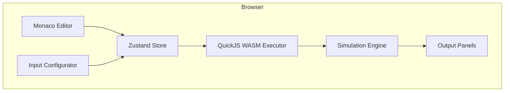

# Edge Actions Playground

A browser-based playground for writing and testing [Azure Front Door Edge Actions](https://learn.microsoft.com/en-us/azure/frontdoor/edge-actions-overview) handlers — no deployment required.

**Live:** https://antonzheng.github.io/edgeactions-playground/

## What is this?

Edge Actions let you run JavaScript at the CDN edge to manipulate requests and responses flowing through Azure Front Door. This playground lets you:

- ✍️ **Write handlers** in a Monaco editor with full IntelliSense for the Edge Actions API
- ▶️ **Execute locally** using QuickJS compiled to WebAssembly (runs entirely in your browser)
- 🔀 **Simulate routing** — see which origin would be selected and how headers/status are modified
- 🔗 **Share** configurations via URL

## Architecture



Everything runs client-side. No backend, no network calls — works offline after initial load.

## How it works

1. **You write a handler** — a `function handler(event)` that receives an `EdgeActionEvent` and returns it modified
2. **You configure the input** — the HTTP request, available origins, and edge context (country, device type, etc.)
3. **You click Run** — QuickJS executes your handler in a WASM sandbox
4. **The simulation engine** takes your handler's output and simulates what Azure Front Door would do: origin selection, header merging, status code override, or blocking the request entirely

> [!NOTE]
> The execution engine uses QuickJS (interpreter). Production uses Hyperlight micro-VMs. Logic behavior is identical but performance characteristics differ.

## Tech Stack

| | |
|--|--|
| React 19 + TypeScript | UI framework |
| Vite | Build tooling |
| Monaco Editor | Code editor with IntelliSense |
| quickjs-emscripten | JavaScript execution (WASM) |
| Zustand | State management |
| GitHub Pages | Hosting (static, via GitHub Actions) |

## Development

```bash
npm install
npm run dev     # http://localhost:5173
npm run build   # Production build → dist/
```

## Documentation

See [`docs/DESIGN.md`](docs/DESIGN.md) for detailed architecture, component breakdown, and implementation notes.
