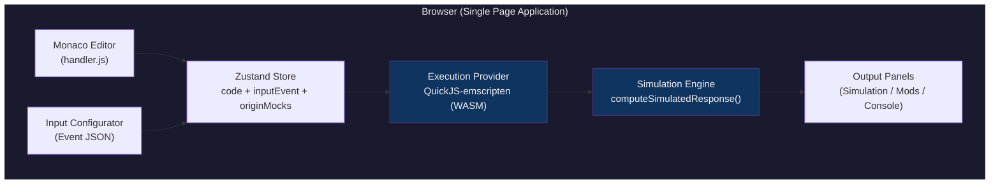
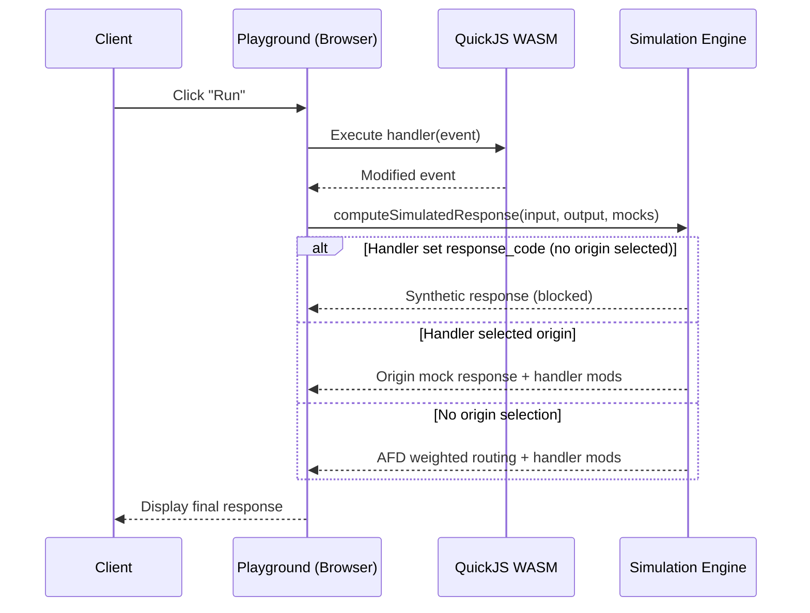
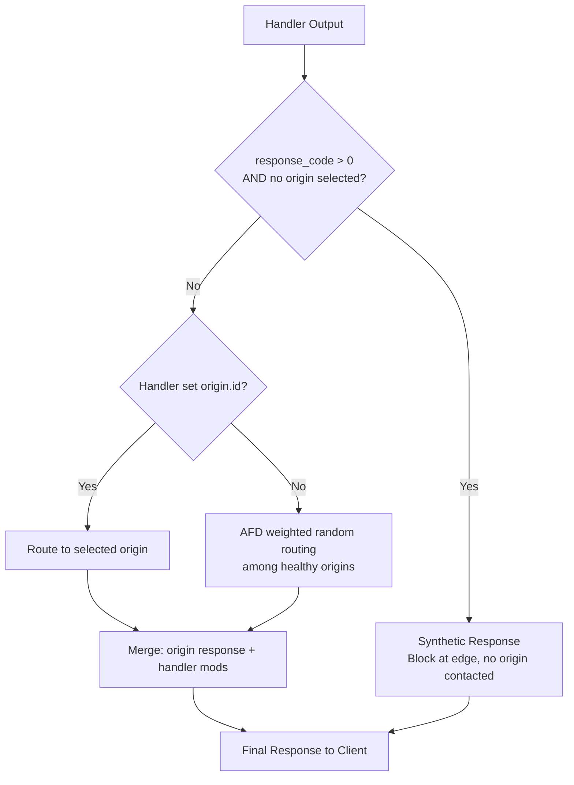
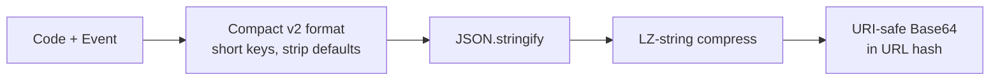

# Edge Actions Playground — Design Document

## Overview

The Edge Actions Playground is a **fully client-side** browser application that lets developers write, test, and share Azure Front Door Edge Actions handlers without deploying to production. It simulates the Edge Actions request lifecycle locally using a WASM-based JavaScript runtime.

**Live:** https://antonzheng.github.io/edgeactions-playground/

---

## Architecture



> [!NOTE]
> No backend, no network calls. Everything runs in-browser — the app works offline after initial load.

---

## Request Lifecycle (Production vs Playground)



---

## Key Components

### 1. Code Editor (`App.tsx` + Monaco)

- Monaco Editor configured for JavaScript with custom IntelliSense
- TypeScript definitions (`EDGE_ACTIONS_DTS`) registered as ambient declarations via `addExtraLib`
- DTS registered in `beforeMount` (before model creation) with URI `ts:edge_actions.d.ts`
- Custom autocomplete snippets for common patterns (header manipulation, URL rewrite)
- File path set to `handler.js` for proper JS language service

### 2. Execution Engine (`src/executor/`)

**Strategy pattern** with pluggable providers:

```typescript
interface ExecutionProvider {
  name: string;
  execute(code: string, event: EdgeActionEvent): Promise<ExecutionResult>;
}
```

**LocalProvider (current):**
- Uses [quickjs-emscripten](https://github.com/nicolo-ribaudo/quickjs-emscripten) — QuickJS compiled to WASM
- Executes handler code in a sandboxed QuickJS context
- Injects `console` object that captures logs
- Serializes `EdgeActionEvent` into the sandbox, calls `handler(event)`, deserializes result

**Why QuickJS-WASM?**
- Runs entirely in-browser — no server needed
- True JavaScript engine (not `eval`) with proper sandboxing
- Close enough to production behavior for handler logic testing
- ~1-1.5MB WASM payload (acceptable for a dev tool)

> [!IMPORTANT]
> Production uses [Hyperlight](https://github.com/hyperlight-dev/hyperlight) micro-VM sandboxes. Performance characteristics differ — QuickJS is interpreter-based while Hyperlight uses ahead-of-time compilation. CPU budget enforcement is not simulated.

### 3. Simulation Engine (`playground-store.ts :: computeSimulatedResponse`)

After executing the handler, the simulation determines what a real AFD response would look like:



**Merging rules:**
- Status code: handler's `response_code` overrides origin status (if set)
- Headers: handler's `response.headers` merge on top of origin headers
- Body: always from origin (body manipulation not yet supported in production)

### 4. Input Configuration (`InputConfigurator.tsx`)

Tabbed editor for the full `EdgeActionEvent` input:

| Tab | Edits |
|-----|-------|
| **Request** | URI, method, headers |
| **Origins** | Origin list (name, weight, priority, health) |
| **Context** | Key-value metadata (country_code, is_mobile, etc.) |
| **Raw JSON** | Direct JSON editing of the event |

### 5. Output Panels

| Panel | Shows |
|-------|-------|
| **Simulation** | Final HTTP response (status, headers, body), which origin was selected and why |
| **Mods** | Diff view of what the handler changed (URL rewrites, header additions, status override) |
| **Console** | Handler's `console.log/warn/error` output |

### 6. Origin Simulation (`OriginSimulation.tsx`)

Displays how the request would be routed:
- **Routing method**: `handler` (explicit selection), `weighted` (AFD default), or `synthetic` (blocked, no origin)
- **Origin grid**: Shows all configured origins with health status; highlights the selected one
- **Mock responses**: Each origin has a configurable mock response (status, headers, body)

---

## Data Model

### EdgeActionEvent (mirrors production contract)

```typescript
interface EdgeActionEvent {
  request: { uri, method, query_string, headers, body }
  origin_data: Array<{ id, name, weight, priority, is_healthy }>
  response: { response_code, headers, body, set_cookie_headers }
  hook_point: number          // 0=ClientRequest (only one supported today)
  context: Record<string, string>  // Read-only edge metadata
  origin: { id: number }      // Handler sets this to select an origin
}
```

### Production Fidelity

| Feature | Playground | Production |
|---------|-----------|------------|
| Header manipulation | ✅ Simulated | ✅ Supported |
| URL rewrite | ✅ Simulated | ✅ Supported |
| Status code override | ✅ Simulated | ✅ Supported |
| Origin selection | ✅ Simulated | ✅ Supported |
| Synthetic response (block) | ✅ Simulated | ✅ Supported |
| Body override | ⚠️ Shown as unsupported | ❌ Not yet implemented |
| Multiple hook points | 🔲 UI exists | 🔲 Only ClientRequest active |
| CPU budget enforcement | ❌ Not simulated | ✅ Enforced |

> [!WARNING]
> Body override (`response.body`, `request.body`) is defined in the FlatBuffer contract but the Actor Agent currently hardcodes `body_override: None` and `is_body_modified: false`. Handler body modifications are silently discarded in production.

---

## Share URLs

State is encoded entirely in the URL hash (no backend needed):

```
https://antonzheng.github.io/edgeactions-playground/#<LZ-compressed JSON>
```

**Encoding pipeline:**



**Compact key mapping:** `c`=code, `i`=input, `r`=request, `u`=uri, `m`=method, `d`=headers, `o`=origin_data, `s`=response, `h`=hook_point, `x`=context, `g`=origin

**Typical URL size:** ~200-400 chars for simple handlers (vs ~2000+ uncompressed)

---

## Technology Stack

| Layer | Technology |
|-------|-----------|
| Framework | React 19 + TypeScript |
| Build | Vite |
| State | Zustand |
| Editor | Monaco Editor (@monaco-editor/react) |
| JS Runtime | quickjs-emscripten (WASM) |
| Compression | lz-string |
| Hosting | GitHub Pages (static) |
| CI/CD | GitHub Actions (build + deploy on push) |

---

## Deployment

```yaml
# .github/workflows/deploy.yml
on push to main:
  1. npm ci && npm run build
  2. Upload dist/ as Pages artifact
  3. Deploy to GitHub Pages
```

- Base path: `/edgeactions-playground/` (configured in `vite.config.ts`)
- Fully static — no server, API, or database
- Works offline after initial load (all WASM loaded at startup)

---

## Future Considerations

1. **Remote execution provider** — Optional POST to a Hyperlight sandbox API for production-accurate execution timing and CPU budget enforcement.

2. **Shared type package** — Extract `EdgeActionEvent` types to an npm package generated from the Rust contracts (via `ts-rs`) to prevent drift between playground, VS Code extension, and production.

3. **Body override support** — When Actor Agent implements `body_override` / `is_body_modified`, update the simulation to use handler-set body.

4. **Additional hook points** — When `OriginResponse` and `ClientResponse` hooks go live, the simulation pipeline will need to chain multiple handler invocations.

5. **Short share URLs** — Could use GitHub Gists as a backend for shorter shareable links.
